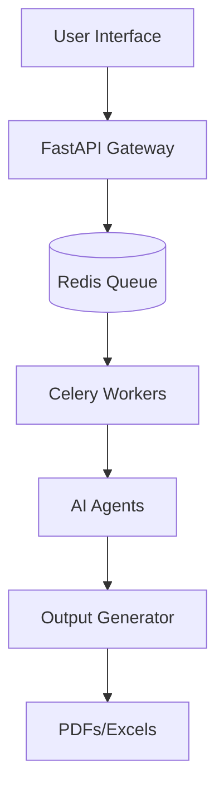

# Career Co-Pilot Pro: Job Application Automation

[](https://github.com/Santhakumarramesh/career-co-pilot-pro/actions/workflows/ci.yml)

**Production-minded candidate-ops platform** with **supervised, policy-gated** automation: job discovery, truthful resume tailoring, and application workflows. Auto-submit is **narrow and gated** (LinkedIn Easy Apply only, when policy allows); treat browser automation as **operator-supervised**, not hands-off production.

### Current production scope

**Start here:** [docs/SYSTEM_VISION.md](docs/SYSTEM_VISION.md) — full blueprint (MCP vs OpenClaw vs Claude layers, control model, workflow phases, north star).

| Doc | Role |
|-----|------|
| [docs/SYSTEM_VISION.md](docs/SYSTEM_VISION.md) | Single entry‑point blueprint for contributors and operators |
| [docs/PRODUCT_SCOPE.md](docs/PRODUCT_SCOPE.md) | What the product is / is not; in‑scope vs out‑of‑scope; autonomy levels |
| [docs/AUTONOMY_MODEL.md](docs/AUTONOMY_MODEL.md) | Job & answer states; truth vs submission safety; `safe_to_submit` |
| [docs/MARKET_PRODUCTION_ROADMAP.md](docs/MARKET_PRODUCTION_ROADMAP.md) | Phased ladder: supervised product → shadow autonomy → narrow production autonomy |
| [docs/RELEASE_NOTES_CADENCE.md](docs/RELEASE_NOTES_CADENCE.md) | When to update [CHANGELOG.md](CHANGELOG.md) with autonomy / public-readiness changes |
| [docs/EXTERNAL_ATS_MANUAL_ASSIST.md](docs/EXTERNAL_ATS_MANUAL_ASSIST.md) | Workday / Greenhouse = **manual_assist** assisted autofill only, never `safe_auto_apply` in v1 |

Implementation checklist and scores: [docs/MARKET_PRODUCTION_AUDIT_CHECKLIST.md](docs/MARKET_PRODUCTION_AUDIT_CHECKLIST.md). **Audit vs reality + phased roadmap:** [docs/PRODUCTION_READINESS_AUDIT_AND_ROADMAP.md](docs/PRODUCTION_READINESS_AUDIT_AND_ROADMAP.md). Technical decision payload (v0): [docs/MCP_APPLICATION_DECISION_CONTRACT.md](docs/MCP_APPLICATION_DECISION_CONTRACT.md).

## 🚀 Overview

This repository provides a **prototype / early automation platform** for AI/ML professionals: Streamlit UI, job discovery (Apify, LinkedIn MCP), ATS-oriented resume tailoring, and document generation.

### What this is not

- **Not** a fully autonomous “apply bot” — external ATS is **manual-assist**; LinkedIn auto-apply is **Easy Apply + policy checks** and still benefits from human oversight.
- **Not** guaranteed zero-error browser automation — logins, checkpoints, and site changes can break flows.
- **Not** a guarantee of employer ATS outcomes — internal scores are optimization hints, not vendor ATS promises.

### Key Features
- **ATS-Oriented Scorer**: Rule-based + LLM semantic analysis; maximizes truthful keyword match (not a guarantee of passing real employer ATS).
- **Truth-safe ATS ceiling (estimate)**: After iterative optimization (and in MCP `score_job_fit`), an internal upper-bound hint when truthful keywords are exhausted or the JD has unsupported terms—still not a guarantee on external ATS.
- **Resume Tailoring**: Automatically updates resume and cover letter for specific roles; truth-safe mode avoids unsupported keyword stuffing.
- **Job Discovery**: Apify actors and LinkedIn MCP. See [docs/setup/linkedin-mcp.md](docs/setup/linkedin-mcp.md).
- **Master Resume Guard**: Filters jobs by fit, blocks unsupported requirements.
- **Interview Coach**: Generates personalized STAR method prep guides.
- **Career Copilot MCP**: LinkedIn Easy Apply (policy-gated auto lane when enabled) and **assisted autofill** for Workday/Greenhouse/Lever — external ATS stay **manual_assist** (you submit). See [docs/setup/job-apply-autofill-mcp.md](docs/setup/job-apply-autofill-mcp.md) and [docs/EXTERNAL_ATS_MANUAL_ASSIST.md](docs/EXTERNAL_ATS_MANUAL_ASSIST.md).
- **Production status**: API/workers are deployable with discipline; unattended browser apply remains higher risk. See [docs/PRODUCTION_READINESS.md](docs/PRODUCTION_READINESS.md), [docs/DEPLOY.md](docs/DEPLOY.md), [docs/PHASE_6_PLAN.md](docs/PHASE_6_PLAN.md), [docs/REPO_HEALTH.md](docs/REPO_HEALTH.md). **CI:** sample workflow in [`contrib/github-actions-ci.yml`](contrib/github-actions-ci.yml) — copy to `.github/workflows/ci.yml` when your token can update workflows (**workflow** scope); runs ruff, scoped mypy, pytest, example profile, startup check.

### Automation Rules (explicit)

- **Auto-apply**: LinkedIn Easy Apply only, `easy_apply_confirmed=True`, high-fit, ATS ≥ 85, no unsupported requirements.
- **Manual-assist**: Greenhouse / Lever / Workday / non–Easy Apply LinkedIn. System prepares docs and fills forms; you submit manually.
- **Skip**: Low-fit jobs, unsupported requirements, or ATS below threshold.

No guarantees: ATS pass, shortlist, or job placement. This is a prototype.

## 📁 Layout

| Path | Role |
|------|------|
| `app/` | FastAPI API + Celery task definitions |
| `agents/` | LangGraph / LLM agents (resume, cover, interview prep, apply runner) |
| `services/` | Tracker, job finder, profile, policy, observability |
| `providers/` | Apify, LinkedIn MCP job sources |
| `ui/` | Streamlit UI |
| `scripts/` | CLI tools (LinkedIn apply, PDF regen) |
| `docs/` | [Architecture](docs/ARCHITECTURE.md), [target workflow](docs/TARGET_OPERATING_MODEL.md), [module map](docs/WORKFLOW_MODULE_MAP.md), [DB migrations](docs/MIGRATIONS.md), [object storage](docs/OBJECT_STORAGE.md), [secrets & config](docs/SECRETS_AND_CONFIG.md), [observability](docs/OBSERVABILITY.md), [setup guides](docs/setup/README.md) |
| `alembic/` | Postgres tracker schema revisions (see [MIGRATIONS.md](docs/MIGRATIONS.md)) |
| `mcp_servers/` | Career Copilot MCP |
| `run_streamlit.py` | Streamlit entrypoint |

## 🏗️ Architecture



## 🛠️ Quickstart

### Streamlit (recommended)

1. **Clone & Setup**:
   ```bash
   git clone https://github.com/Santhakumarramesh/career-co-pilot-pro.git
   cd career-co-pilot-pro
   python -m venv venv
   source venv/bin/activate
   pip install -r requirements.txt
   ```

2. **Configure** (optional): Copy `.env.example` to `.env` and add `OPENAI_API_KEY`, `APIFY_API_TOKEN` (or enter in sidebar).

3. **MCP/Apply** (optional): For Career Copilot MCP and LinkedIn apply flows:
   ```bash
   pip install -r requirements-mcp.txt
   playwright install chromium
   ```

4. **Run the app**:
   ```bash
   streamlit run run_streamlit.py
   ```

### Backend (FastAPI + Celery)

Optional installs: `pip install -e ".[apply]"` (MCP + Playwright for apply tools), `pip install -e ".[production]"` (Postgres, JWT, Alembic, S3, metrics extras).

1. **Run API**:
   ```bash
   pip install .
   uvicorn app.main:app --reload
   ```

2. **Run Worker**:
   ```bash
   celery -A app.tasks:celery worker --loglevel=info
   ```

3. **Docker (optional)** — image + Redis + API + worker: see [docs/DEPLOY.md](docs/DEPLOY.md#docker) and root `docker-compose.yml` (`docker compose up --build`).

4. **List applications (scoped)** — `GET /api/applications` returns tracker rows for the authenticated user (`demo-user` sees all; JWT / `api-key-user` see only their `user_id` rows).

5. **Postgres tracker (optional)** — `TRACKER_USE_DB=1` and `TRACKER_DATABASE_URL=postgresql://…` (or `DATABASE_URL`). Install driver: `pip install .[postgres]`. Pool: `TRACKER_PG_POOL_MAX` (set `TRACKER_PG_POOL=0` for one connection per request).

6. **Postgres migrations (optional)** — `pip install .[migrations]` then from repo root: `alembic upgrade head`. See [docs/MIGRATIONS.md](docs/MIGRATIONS.md).

7. **S3 artifacts (optional)** — `pip install .[s3]`, set `ARTIFACTS_S3_BUCKET`. Celery uploads PDFs after `save_documents`; API: `GET /api/applications/by-job/{job_id}?signed_urls=true`. See [docs/OBJECT_STORAGE.md](docs/OBJECT_STORAGE.md).

8. **Celery + LangGraph (Phase 3.3)** — Workers use `agents/celery_workflow.py` by default (`CELERY_USE_LANGGRAPH=0` for legacy). Idempotency: `POST /api/jobs` body `idempotency_key`. Job status: `GET /api/jobs/{id}?include_result=true&include_task_state=true`. See [docs/WORKER_ORCHESTRATION.md](docs/WORKER_ORCHESTRATION.md).

9. **Admin API** — `GET /api/admin/applications` lists all tracker rows (no `user_id` filter). Requires admin: JWT claims `role` / `roles` / `realm_access.roles` matching `JWT_ADMIN_ROLES`, or `API_KEY_IS_ADMIN=1` with `X-API-Key`.

10. **Insights (Phase 13 / 43)** — `GET /api/insights` returns tracker rollups, optional audit JSONL tail, heuristic suggestions, and **`answerer_review`** aggregates (parsed from tracker `qa_audit._answerer_review` when apply runs log it). Admin: `GET /api/admin/insights`. Streamlit tracker tab shows the same (no audit file by default). CLI: `PYTHONPATH=. python scripts/print_insights.py` (`--json`, `--no-audit`, `--user-id`).

11. **Follow-up digest** — `GET /api/follow-ups/digest` returns `{ text, items, count }` for due reminders (paste into email/Slack). Admin: `GET /api/admin/follow-ups/digest`. CLI: `PYTHONPATH=. python scripts/follow_up_digest.py`. Cron-friendly **multi-channel**: `scripts/notify_follow_up_digest.py` (webhook → Telegram → SMTP, each if configured). Single-channel scripts and env vars: [docs/FOLLOW_UPS.md](docs/FOLLOW_UPS.md).

## 🔒 Security

Security is a top priority for `career-co-pilot-pro`. Please follow these guidelines:

- **Secrets Management**:
  - Always use `.env` files for environment-specific secrets.
  - Use the provided `.env.template` (mock) to ensure all required keys are set.
  - Never commit your credentials to GitHub.
- **Input Validation**:
  - All job payloads are validated using Pydantic models in `app/main.py`.
  - Avoid using `shell=True` or any direct command execution with user-provided input in job handlers.
- **Authentication**:
  - API: `X-API-Key` when `API_KEY` is set; optional JWT (`JWT_SECRET` and/or OIDC `JWT_JWKS_URL` / `JWT_ISSUER`) + `Authorization: Bearer` (`pip install .[auth]`). See [docs/PHASE_3_PLAN.md](docs/PHASE_3_PLAN.md) and [docs/PHASE_4_PLAN.md](docs/PHASE_4_PLAN.md).
- **Production config**:
  - Set `APP_ENV=production` for stricter startup checks; optional AWS Secrets Manager via `AWS_SECRETS_MANAGER_SECRET_ID`. See [docs/SECRETS_AND_CONFIG.md](docs/SECRETS_AND_CONFIG.md).
- **Observability**:
  - Every job execution is enqueued with a unique UUID for tracking and auditing.

## 📄 License
MIT License - see [LICENSE](LICENSE) for details.
