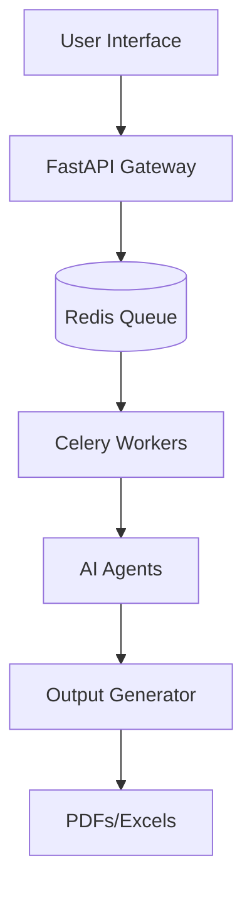

# Career Co-Pilot Pro: Job Application Automation

AI-powered system to automate job discovery, resume tailoring, and interview preparation with 100% ATS compatibility.

## 🚀 Overview

This repository provides a production-ready, multi-agent AI system designed to streamline the job search process for AI/ML professionals.

### Key Features
- **Semantic ATS Scorer**: Evaluates your resume against job descriptions using LLMs.
- **Resume Tailoring**: Automatically updates your resume and cover letter for specific roles.
- **Job Discovery**: Automated job searching via Apify actors.
- **Production Infrastructure**: FastAPI backend with Celery workers for background processing.
- **Interview Coach**: Generates personalized STAR method prep guides.

## 🏗️ Architecture



## 🛠️ Quickstart

1. **Clone & Setup**:
   ```bash
   git clone https://github.com/Santhakumarramesh/job-automation.git
   cd job-automation
   python -m venv venv
   source venv/bin/activate
   pip install .
   ```

2. **Run Backend**:
   ```bash
   uvicorn app.main:app --reload
   ```

3. **Run Worker**:
   ```bash
   celery -A app.tasks worker --loglevel=info
   ```

4. **Run Sidebar UI**:
   ```bash
   streamlit run app.py
   ```

## 🔒 Security

Security is a top priority for `job-automation`. Please follow these guidelines:

- **Secrets Management**:
  - Always use `.env` files for environment-specific secrets.
  - Use the provided `.env.template` (mock) to ensure all required keys are set.
  - Never commit your credentials to GitHub.
- **Input Validation**:
  - All job payloads are validated using Pydantic models in `app/main.py`.
  - Avoid using `shell=True` or any direct command execution with user-provided input in job handlers.
- **Authentication**:
  - The API skeleton includes a dependency-injection pattern for authentication (`app/auth.py`). 
  - Ensure this is integrated with your organizational auth provider (e.g., Auth0, Firebase, or custom JWT).
- **Observability**:
  - Every job execution is enqueued with a unique UUID for tracking and auditing.

## 📄 License
MIT License - see [LICENSE](LICENSE) for details.
