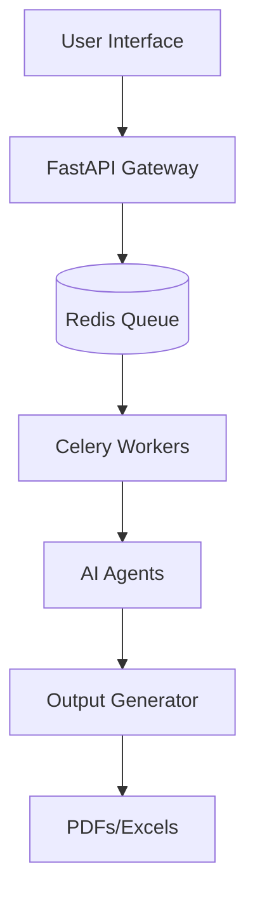

# Career Co-Pilot Pro: Job Application Automation

AI-powered system to automate job discovery, resume tailoring, and interview preparation with ATS-oriented matching.

## 🚀 Overview

This repository provides a **prototype / early automation platform** for AI/ML professionals: Streamlit UI, job discovery (Apify, LinkedIn MCP), ATS-oriented resume tailoring, and document generation.

### Key Features
- **ATS-Oriented Scorer**: Rule-based + LLM semantic analysis; maximizes truthful keyword match (not a guarantee of passing real employer ATS).
- **Resume Tailoring**: Automatically updates resume and cover letter for specific roles; truth-safe mode avoids unsupported keyword stuffing.
- **Job Discovery**: Apify actors and LinkedIn MCP. LinkedIn MCP integration is in progress; see [LINKEDIN_MCP_SETUP.md](LINKEDIN_MCP_SETUP.md).
- **Master Resume Guard**: Filters jobs by fit, blocks unsupported requirements.
- **Interview Coach**: Generates personalized STAR method prep guides.
- **Job Apply Autofill MCP**: Quick autofill for LinkedIn Easy Apply and external ATS (Greenhouse, Lever, Workday). Resumes renamed per job: `{Name}_{Position}_at_{Company}_Resume.pdf`. See [JOB_APPLY_AUTOFILL_MCP_SETUP.md](JOB_APPLY_AUTOFILL_MCP_SETUP.md).
- **Production status**: Strong prototype, not production-ready. See [docs/PRODUCTION_READINESS.md](docs/PRODUCTION_READINESS.md).

### Automation Rules (explicit)

- **Auto-apply**: LinkedIn Easy Apply only, `easy_apply_confirmed=True`, high-fit, ATS ≥ 85, no unsupported requirements.
- **Manual-assist**: Greenhouse / Lever / Workday / non–Easy Apply LinkedIn. System prepares docs and fills forms; you submit manually.
- **Skip**: Low-fit jobs, unsupported requirements, or ATS below threshold.

No guarantees: ATS pass, shortlist, or job placement. This is a prototype.

## 🏗️ Architecture



## 🛠️ Quickstart

### Streamlit (recommended)

1. **Clone & Setup**:
   ```bash
   git clone https://github.com/Santhakumarramesh/career-co-pilot-pro.git
   cd career-co-pilot-pro
   python -m venv venv
   source venv/bin/activate
   pip install -r requirements.txt
   ```

2. **Configure** (optional): Copy `.env.example` to `.env` and add `OPENAI_API_KEY`, `APIFY_API_TOKEN` (or enter in sidebar).

3. **MCP/Apply** (optional): For Job Apply Autofill and LinkedIn apply flows:
   ```bash
   pip install -r requirements-mcp.txt
   playwright install chromium
   ```

4. **Run the app**:
   ```bash
   streamlit run app.py
   ```

### Backend (FastAPI + Celery)

1. **Run API**:
   ```bash
   pip install .
   uvicorn app.main:app --reload
   ```

2. **Run Worker**:
   ```bash
   celery -A app.tasks worker --loglevel=info
   ```

## 🔒 Security

Security is a top priority for `career-co-pilot-pro`. Please follow these guidelines:

- **Secrets Management**:
  - Always use `.env` files for environment-specific secrets.
  - Use the provided `.env.template` (mock) to ensure all required keys are set.
  - Never commit your credentials to GitHub.
- **Input Validation**:
  - All job payloads are validated using Pydantic models in `app/main.py`.
  - Avoid using `shell=True` or any direct command execution with user-provided input in job handlers.
- **Authentication**:
  - API auth is stubbed (`app/auth.py`); implement real auth (OAuth2/JWT) before production use.
- **Observability**:
  - Every job execution is enqueued with a unique UUID for tracking and auditing.

## 📄 License
MIT License - see [LICENSE](LICENSE) for details.
