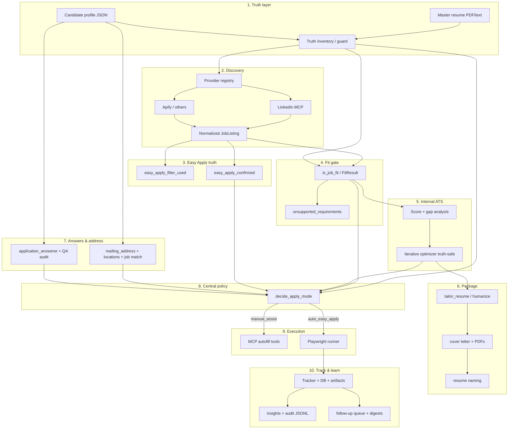

# Product vision → architecture & module map

**Purpose:** One place for the **combined end-to-end vision**, a **diagram**, and **who owns what** in this repo. Detailed phase tables live in [WORKFLOW_MODULE_MAP.md](WORKFLOW_MODULE_MAP.md); the narrative north star is [TARGET_OPERATING_MODEL.md](TARGET_OPERATING_MODEL.md).

**One-line workflow**

**Master resume + candidate profile → job search (MCP/providers) → normalized job + Easy Apply confirmation → truthful fit gate → internal ATS optimization (truth-safe) → tailored package → truthful address/answers → central apply decision → auto Easy Apply or manual-assist → tracking → follow-up → learning loop.**

**Definition (best short form)**

A **truthful high-fit** automation stack: find strong matches, never claim outside resume + profile, push **internal** ATS alignment toward 100 without implying real employer ATS guarantees, auto-submit **only** when Easy Apply is **confirmed** and policy allows, and **track / audit / follow up** so you can improve over time.

---

## End-to-end diagram (logical layers)

---

## Vision pillars → primary modules

Legend: **✅** in place · **⚠️** partial / needs hardening · **📋** planned or light

| # | Vision pillar | Primary owner (path) | Notes |
|---|----------------|----------------------|--------|
| 1 | Master resume as truth source | `agents/master_resume_guard.py`, `services/document_service.py` | Parse + inventory + unsupported JD checks |
| 2 | Candidate profile (application layer) | `services/profile_service.py`, `config/candidate_profile.example.json` | Extend validation / auto-apply gates as needed |
| 3 | Job discovery (MCP + providers) | `providers/registry.py`, `providers/linkedin_mcp_jobs.py`, `providers/apify_jobs.py` | Unified schema in `providers/common_schema.py` |
| 4 | Easy Apply confirmation | `JobListing.easy_apply_*`, `providers/linkedin_mcp_jobs.py`, MCP tools | Keep **filter** vs **confirmed** separate; broaden confirmation coverage **⚠️** |
| 5 | Truthful fit gate | `agents/master_resume_guard.py`, `services/ats_service.py` (`check_fit_gate`) | apply / manual_review / reject + unsupported list |
| 6 | ATS-oriented JD matching | `agents/enhanced_ats_checker.py`, `services/ats_service.py` | **Internal** score ≠ employer ATS guarantee (README / PRODUCTION_READINESS) |
| 7 | Truth-safe iterative optimizer | `agents/iterative_ats_optimizer.py`, `services/ats_service.py` | Ceiling / “max truthful” UX still **📋** |
| 8 | Tailored documents + naming | `agents/resume_editor.py`, `agents/cover_letter_generator.py`, `services/resume_naming.py` | Job-specific PDF naming |
| 9 | Address by job location (truthful) | `mailing_address`, `application_locations`, `services/job_location_match.py`, answerer | **Alternate addresses per region** + selector logic still **📋** beyond current structured fields |
| 10 | Humanized answer engine | `agents/application_answerer.py` | Stronger manual-review signaling **⚠️** |
| 11 | Central policy engine | `services/policy_service.py` | `decide_apply_mode()`; extend with answerer risk **⚠️** |
| 12 | MCP tool layer | `mcp_servers/job_apply_autofill/server.py` | Map wish-list tools to existing + gaps **⚠️** |
| 13 | Auto-apply execution | `agents/application_runner.py` | Easy Apply–only auto path; external ATS not auto-submit |
| 14 | Manual-assist lane | UI export, MCP package, runner `manual_assist` | External ATS heuristics **⚠️** |
| 15 | Tracking & audit | `services/application_tracker.py`, `services/tracker_db.py`, `services/observability.py` | CSV / SQLite / Postgres + API |
| 16 | Follow-up automation | `services/follow_up_service.py`, MCP follow-up, `scripts/*_follow_up*.py` | Queue, digests, email / webhook / Telegram |
| 17 | Learning loop | `services/application_insights.py`, `scripts/print_insights.py`, tracker correlations | Heuristics today; deeper closed-loop tuning **📋** |

---

## API & platform (supports the vision, not the ATS loop itself)

| Area | Path |
|------|------|
| REST API | `app/main.py` (`/api`, `/api/v1`), `app/auth.py` |
| Background jobs | `app/tasks.py`, `agents/celery_workflow.py` |
| Rate limit / CORS | `services/rate_limit.py`, `services/api_cors.py` |
| Startup validation | `services/startup_checks.py`, `scripts/check_startup.py` |

---

## What you already have vs. what to tighten next

**Already strong:** modular UI (`ui/streamlit_app.py`), fit gate, internal ATS + iterative loop, multi-provider jobs, profile + answerer, resume naming, tracker + Postgres path, policy service, MCP autofill + runner, follow-ups + insights.

**Highest-leverage upgrades (aligned with this vision):** Easy Apply **confirmation** coverage; **truth ceiling** messaging in optimizer UX; **address routing** (alternate truthful addresses by region); **answerer** manual-review flags feeding **policy**; MCP tool surface documented as one catalog; external ATS remains **manual-assist** by design.

---

## Related docs

| Doc | Role |
|-----|------|
| [TARGET_OPERATING_MODEL.md](TARGET_OPERATING_MODEL.md) | Phased narrative (same story, more prose) |
| [WORKFLOW_MODULE_MAP.md](WORKFLOW_MODULE_MAP.md) | Per-phase checklist + file-level status |
| [ARCHITECTURE.md](ARCHITECTURE.md) | Layers and technical data flow |
| [TWO_LANE_APPLY_STRATEGY.md](TWO_LANE_APPLY_STRATEGY.md) | Auto vs manual lane rules |
| [REPO_HEALTH.md](REPO_HEALTH.md) | Honest prototype vs production snapshot |
